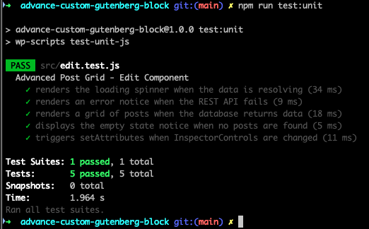

# Advanced Gutenberg Custom Block: Post Grid

A production-ready, dynamic Gutenberg block built for enterprise WordPress environments. This plugin demonstrates the integration of state-driven React development—specifically focusing on data fetching, error boundaries, and modern hooks—with high-performance, VIP-standard PHP server-side rendering.

The editor interface is built with React and uses the `@wordpress/data` store for cached REST API fetching, while the frontend relies on a standard PHP `render.php` file for secure, SEO-optimized server-side rendering.

## 🚀 Technical Architecture

This block utilizes a **Hybrid Rendering Architecture** to balance editor reactivity with frontend performance:

* **Backend Rendering (PHP):** Employs dynamic server-side rendering via `render.php`. This ensures maximum SEO compatibility, zero-delay initial page loads, and native compatibility with enterprise-level caching layers (like Nginx or Varnish) for high-traffic environments.
* **Frontend State (React):** The editor interface is a state-driven React application. It leverages the **WordPress Block API v3** and the **@wordpress/data** store to handle complex data-fetching lifecycles. By utilizing modern hooks and centralizing state management, the block resolves REST API payloads efficiently without redundant network requests.
* **Database Optimization:** Implements `no_found_rows => true` to bypass heavy SQL calculations, significantly reducing query overhead during server-side execution.
* **Core Web Vitals (CWV):** Frontend styling implements strict BEM architecture. Featured images utilize modern `aspect-ratio` CSS and explicit size constraints to eliminate Cumulative Layout Shift (CLS), while enforcing native browser lazy-loading.
* **Resilient UI:** Features explicit **Error Boundaries** within the React component tree to gracefully handle API interruptions, ensuring the Gutenberg editor remains stable even during backend failures.
* **Automated Testing:** Includes a Jest unit testing suite utilizing `@testing-library/react` to verify complex UI lifecycles, user interactions (`fireEvent`), and API failure states.

## 🛠️ Installation & Setup

To use this block in a local or production environment, you need to compile the React assets.

1. Clone the repository into your WordPress plugins folder (`/wp-content/plugins/`):
```bash
git clone [https://github.com/upeshv/advanced-gutenberg-post-grid.git](https://github.com/upeshv/advanced-gutenberg-post-grid.git)
cd advanced-gutenberg-post-grid

2. Install Node dependencies:
    `npm install`

3. Run the automated test suite and linters to verify your local setup:
    `npm run lint`
    `npm run test:unit`

4. Compile the assets for production:
    `npm run build`

5. Activate the plugin through the 'Plugins' screen in the WordPress Admin Dashboard.

## 💻 Available NPM Commands

This project uses `@wordpress/scripts` for deterministic build and test pipelines.

* **`npm start`**: Compiles assets in development mode and watches for changes.
* **`npm run build`**: Compiles and minifies assets for production.
* **`npm run lint`**: Runs ESLint and Stylelint to ensure strict JS and SCSS coding standards.
* **`npm run test:unit`**: Executes the Jest testing suite (`src/edit.test.js`) to verify component lifecycles.

## 🧪 Testing the Block UI

To verify the dynamic fetching and filtering functionality:

1. Ensure your WordPress installation has at least 3-5 published posts with varying Categories and Featured Images.
2. Navigate to any Page or Post and add the **Advanced Post Grid** block.
3. Use the Block Sidebar (Inspector Controls) to test the reactive UI:
    * **Grid Layout:** Adjust the "Number of Posts" and "Columns" sliders. Toggle the "Show Featured Image" control to see the DOM update instantly.
    * **Query Settings:** Change the "Filter by Category" and "Order By" dropdowns to verify cached REST API resolution.
4. Save the post and verify the frontend output perfectly matches the editor preview.

## 🛡️ Security & Compatibility

* **Type-Safe Attributes:** All block attributes are strictly cast (e.g., `absint`, `rest_sanitize_boolean`) before being evaluated.
* **Late Escaping:** Frontend data is escaped immediately before output using `esc_html`, `esc_url`, and `wp_kses_post` adhering to strict WordPress security standards.
* **Compatibility:** Optimized for WordPress 6.1+ (Tested up to 6.5) and PHP 7.4 through 8.2+.

## ✅ Development Verification

To ensure enterprise-grade stability, this block undergoes strict automated and visual verification before deployment:

* **Automated Logic:** 100% pass rate on Jest unit tests covering API resolution and error handling.
* **Asset Pipeline:** Webpack-optimized production builds for minimal frontend footprint.



## ❓ FAQ

**Does the block make constant API calls?**
No. The implementation relies on the local WordPress data store cache. It only pings the REST API when a user explicitly modifies block attributes that change the query parameters.